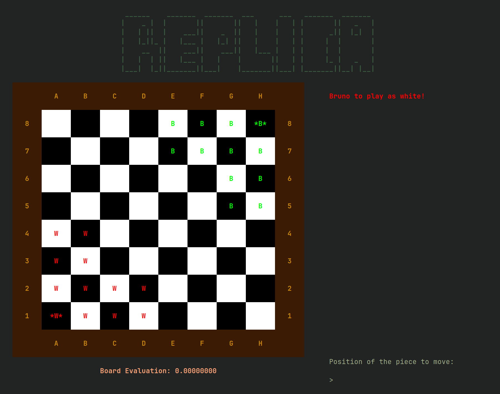
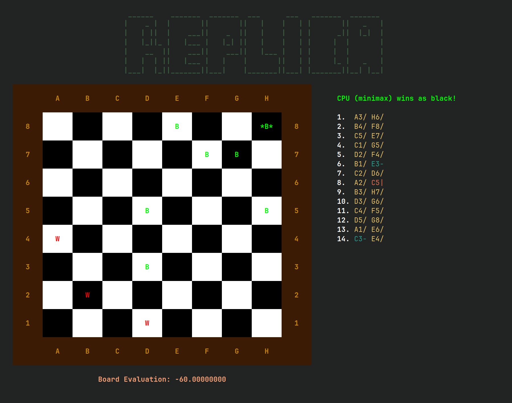

# Functional and Logical Programming (PFL) Project 2

## Game_Group: Replica_7

<figure align="center">

| Name                                           |      E-mail       | Contribution |
| :--------------------------------------------- | :---------------: | -----------: |
| Bruno Ricardo Soares Pereira de Sousa Oliveira | up202208700@up.pt |          50% |
| Rodrigo Albergaria Coelho e Silva              | up202205188@up.pt |          50% |

</figure>

### Tasks Developed

- **Bruno Ricardo Soares Pereira de Sousa Oliveira**
  - Implementation of the Board and Game Logic
  - Development of third level of AI (Minimax)
  - Documentation and Review of the code
- **Rodrigo Albergaria Coelho e Silva**
  - Implementation of the User Interaction and Interface
  - Development of third level of AI (Minimax)
  - Documentation and Review of the code

## Installation and Execution

The project was made to run using SICStus Prolog 4.9. The process is identical for both Linux and Windows operating systems:

1. **Make sure you are using a proper terminal**: the project uses ANSI escape sequences for a better interface. In order for them to work, please use a terminal that supports these sequences:
   - **Windows**: **PowerShell** or Windows Terminal.
   - **Linux**: Any **modern terminal emulator** should work.  
  > **Note**: we also assumed that the terminal size is of about 120x40 characters, some window or font resizing may be needed to correctly load the interface.
2. **Load the Project**: navigate to the project directory and load the main file by executing the following command:
   ```bash
   sicstus -l src/game.pl
   ```
3. **Start the Game**: once SICStus Prolog has loaded, start the game by calling:
   ```prolog
   play.
   ```

## Description of the Game

Replica is a two-player board game played on an 8x8 checkered board. Each player has 12 flippable checkers that start placed in opposite corners of the board as a 2x2 square with an extra 2x2 square on each side. The pieces in the corners start the game flipped over (indicating a king).

The white player is the first to move and players alternate turns until one of them wins. On each turn, one player can perform one of the following actions:  
 - **Step**: move a piece forward one square (horizontally, vertically or diagonally) into a *free square*.  
 - **Jump**: move a piece forward in a straight line (horizontally, vertically or diagonally) over friendly pieces until it reaches the first *free square*.  
 - **Transform**: flip a friendly non-king piece in line-of-sight (horizontally, vertically or diagonally) of a friendly king, creating another friendly king. Line-of-sight is blocked only by enemy pieces.  

For steps and jumps, a *free square* is considered one that is not occupied by a friendly piece. If there is an enemy piece in the destination square, it is captured by replacement.

A player wins the game by getting a friendly king into the opposite corner of the board or capturing any of the enemy's kings.

## Considerations for Game Extensions

For this game, we agreed that part of what makes is special is the simplicity of the rules. Some examples of additional rules were provided in the original game description, but we didn't find any of them to be particularly fitting, as they tended to involve completely game-changing mechanics. We also considered prompting user input for the board size, but it couldn't be much less than 8x8 (because of the board setup) and larger board sizes would only make the games less interesting as most of the moves would just be passive, so we decided against it.

Nonetheless, we kept the game implementation flexible to allow for variable board sizes and additional rules to be added in the future easily (although the interface might need some small adjustments). The interface is also extendable to allow the user to choose the theme and other parameters. Finally, we also implemented a third level of AI using Minimax to make the game more challenging (more details below).

## Game Logic

### Game Configuration Representation

Before the actual game starts, some configurations are needed to define what type of game will be played. These configurations are stored in a `game_config` functor that is filled in the initial menus of the game. It is structured as follows:

```prolog
GameConfig = game_config(GameMode, Player1Info, Player2Info).
PlayerInfo = player_info(PlayerName, PlayerDifficulty).
```

where `GameMode` is an integer between 1 and 4 (1 for Human vs Human, 2 for Human vs Computer, 3 for Computer vs Human and 4 for Computer vs Computer), `PlayerName` is a string with the name of the player, and `PlayerDifficulty` is an integer between 0 and 3 (0 for Human, 1 for Easy (random moves), 2 for Medium (greedy moves), 3 for Hard (minimax moves)).

The `GameConfig` is saved onto the initial `GameState` and is used throughout the game to access the name of the players and how the next move should be obtained.

### Internal Game State Representation

At any step, the game state is stored in a `state` functor, which has the following schema:

```prolog
GameState = state(Board, CurrentPlayer, KingEaten, MoveCounter, GameConfig)
Board = board(Tiles, Size)
```

All the information stored is useful for at least one aspect of the game, whether it is related to the game logic and rules or the visualization.

The board is represented using the `board` functor, which contains the board tiles and size. The latter is used to allow flexible board sizes more efficiently, even though the game only allows a fixed 8x8 size board. For a board of size N, Tiles is a list matrix of N x N tiles, where each tile can be one of five atoms: `empty` (empty space), `white_piece` (normal white piece), `black_piece` (normal black piece), `white_king` (white king piece) and `black_king` (black king piece).

The game state also contains the following attributes:

- **Current Player**: can be either `white` or `black`, representing that the next player to perform a move is the player that controls the white or the black pieces, respectively.
- **Color of the Previously Eaten King**: can be `white`, `black` or `none` (when no king has been eaten yet). This information is stored because of the second winning condition of the game, which states that a player wins if it captures an enemy king.
- **Move Counter**: indicates the number of moves that were executed in the game. It is used to enumerate the moves in the move history.
- **Game Configuration**: identical to the configuration passed in the `initial_state/2` predicate.

The initial game state is generated with `initial_state/2` and contains the initial board configuration, with each set of 12 pieces in opposite corners and the kings at the last corner tiles, the current player set to `white`, the eaten king set to `none` and the move counter set to `0`. As the game develops, each piece gets closer to the enemy corner, and each player loses more and more pieces. Since the actions of this game are not reversible, it does not suffer from loops, guaranteeing its end. A player wins when one of their kings gets into the enemy corner or an enemy king is captured, and these conditions can be verified with `game_over/2`. Examples of initial, intermediate and final game states are presented in Fig. 1.

<figure align="center">
  <div style="display: flex; justify-content: center; align-items: center; gap: 10px;">
    
    
  </div>
  <div style="display: flex; justify-content: center; align-items: center; gap: 10px;">
    
    
  </div>
  <figcaption>Fig. 1 Examples of Different States of the Game (Initial, Intermediate and Final)</figcaption>
</figure>

<!--
\begin{figure}[ht]
    \centering
    \includegraphics[width=0.3\linewidth]{./imgs/game-start.png}
    \includegraphics[width=0.3\linewidth]{./imgs/game-mid.png}
    \includegraphics[width=0.3\linewidth]{./imgs/game-end.png}
    \caption{Examples of Different States of the Game (Initial, Intermediate and Final)}
\end{figure}
-->

### Move Representation

In Replica, each piece can perform three types of moves:

- **Step**: A piece moves on square forward
- **Jump**: A piece jumps forward in a straight line to the first square not occupied by a friendly piece
- **Transform**: A non-king piece in sight of a friendly king is converted into a king

One consideration we have to mention is that jumps and steps can be seen as the same operation (advance a piece), performed in different contexts (a step occurs when no friendly pieces are in front of the piece, and a jump occurs otherwise). For this reason, we represented both kinds of moves using the same notation. For both, each move can be characterized by the piece to be moved and the direction of movement, since the piece can only move to one square on each axis. The transform just needs the piece to be transformed to be executed.

With this, we used the following functors to represent the moves:

- Steps and jumps are encoded with the `step(Position, Direction)` functor, where `Position` is the position in the board of the piece to be moved and `Direction` is the direction of movement, which can be either be `vertical`, `horizontal` or `diagonal`.
- Transforms are represented with `transform(Position)`, where `Position` is the position of the piece to be converted.

### Game State Evaluation

The game state evaluation is done with the `value/3` predicate. In normal conditions, it is deduced from the individual values of each piece on the board. Each piece has a fixed contribution value of `2`, since it is preferable to have more pieces due to the capture mechanic, and an additional value which varies with the piece's position on the board, calculated with the formula `3/(D + 1)`, where `D` is the [taxicab distance](https://en.wikipedia.org/wiki/Taxicab_geometry) between the piece's position and the opposite corner, since having pieces in more advanced positions favor winning by having a friendly king reach the opposite corner. Nonetheless, if a state is final, the state value is fixed with `60` in favor of the winning player. This value is used, since each one of the 12 friendly pieces can contribute with a maximum of `5` to the state value (and not at the same time).

In the piece evaluation, while each friendly piece contributes positively to the state value, each enemy piece contributes negatively. This results in the state value for a player being always the numeric symmetric of the state value for the other player.

### User Interaction

The files associated with the user interaction are the `display.pl` and `input.pl`. The `display.pl` file contains all predicates that print something to the screen (game title, option menus, **input prompts**, game board and other indications such as evaluation or move history). This file makes extensive use of the `ansi.pl` module developed and uses the configurations specified in the `theme.pl`, more details about this can be found below. The `input.pl` file contains the predicates responsible for reading user input (numbers/options, strings/names and positions/coordinates), without producing any output, in the following ways:  
  - **Numbers**: read as the resulting integer from concatenating all the digits in the input string (i.e. skipping all the other characters until it reaches the end of the line)  
  - **Strings**: read as the concatenation of all the characters with ASCII codes between 32-127, which includes spaces, numbers, letters and other symbols and punctuation (also skips all other characters until it reaches the end of the line)  
  - **Positions**: referenced as a spreadsheet where the position is a combination of letters and numbers. Letters refer to the column, numbers to the row, and their order doesn't matter. Characters that are larger than a given coordinate range (or are irrelevant) are skipped automatically. When the coordinate only needs one character, the first valid character is considered. Otherwise, all valid symbols for a given coordinate are read and concatenated for spreadsheet-like indexing (i.e. rows: ... 9, 10, 11 ... and columns: ... Z, AA, AB ...). This was done to make the predicates more flexible for larger board sizes.  
  > As an example, all of the following "inputs" represent the same position (Column A, Row 8) in an 8x8 board: `a8`, `az8`, `ai8`, `8a`, `89za`, `8 _ a`, `l8-askd-jsa_das123888812312`.

When it comes to input validation, some small validations are performed by the input predicates (mostly skipping unwanted characters), but on top that, the predicates from the `display.pl` that use them also make some verifications:

- **Options**: for option menus, it is checked that the number is contained between 1 and the total number of options
- **Positions**: for positions, it is checked that the position corresponds to a piece with valid moves for the current state of the board

Any errors that occur from the previous validations will simply display an error message to the user and prompt for new input from the user.

<figure align="center">
  <div style="display: flex; justify-content: center; align-items: center; gap: 10px;">
    
    
  </div>
  <figcaption>Fig. 2 Examples of input validations</figcaption>
</figure>

<!--
\begin{figure}[ht]
    \centering
    \includegraphics[width=0.45\linewidth]{./imgs/input-option.png}
    \includegraphics[width=0.45\linewidth]{./imgs/input-position.png}
    \caption{Examples of input validations}
\end{figure}
-->

### Game Interface

As mentioned before, our game uses ANSI escape sequences to provide a better interface and assumes a terminal size of 120x40 characters to fully display the entire game. For this, we developed a module `ansi.pl` that contains all the necessary predicates to use these sequences. These predicates are capable of changing the text color, background color, text style, cursor position, clearing the screen, and other useful actions.

Additionally, we also allow users to modify the themes of the interface by changing the `theme.pl` file. This file is the one that contains the configurations for the interface, such as the colors used for the different elements of the display and the symbols used for the pieces. The game comes with a default theme, but we also define some other themes that can be swapped directly with the `theme.pl` file.

<figure align="center">
  <div style="display: flex; justify-content: center; align-items: center; gap: 10px;">
    
    
  </div>
  <figcaption>Fig. 3 Examples of other themes (Dracula and Gruvbox)</figcaption>
</figure>

<!--
\begin{figure}[ht]
    \centering
    \includegraphics[width=0.45\linewidth]{./imgs/dracula.png}
    \includegraphics[width=0.45\linewidth]{./imgs/gruvbox.png}
    \caption{Examples of other themes (Dracula and Gruvbox)}
\end{figure}
-->

### Third Level of AI (Minimax)

Finally, we also took an extra step and developed a third level for the computer players, based on the Minimax algorithm.

The Minimax algorithm is a decision-making algorithm used in two-player games like Replica. It aims to choose a move that minimizes the possible loss for a worst case scenario, by determining the best move that a player can make against the opponent's best moves, predicting all game states in a search tree with a maximum depth.

Our implementation of Minimax uses depth-first search to analyze the search space and is mainly centered around the predicates `minimax/5` and `evaluate_minimax_move/6`. The former performs, from a certain game state, the evaluation of all possible adjacent states, using `evaluate_minimax_move/6`, and returns the best or worst value for the maximizing player, depending on the maximize state. It also evaluates the state immediately if the state is final or the max search depth is reached. The latter executes the given move, proceeds on the Minimax algorithm by calling `minimax/5` with the new state, and returns the value of the move. Therefore, these predicates are mutually recursive.

In our game, after some fine-tuning, we found that a search depth of 3 was the most adequate, which provided a good balance between the time it takes to perform a move (in general, less than two or three second from our tests) and the quality of the move, allowing for very interesting game scenarios from the computer players.

## Conclusions

In conclusion, we believe that the project was a success as we were able to successfully meet the requirements specified. By implementing the game logic, we were able to learn more not only about project structuring and programming in Prolog, but also about artificial intelligence, game theory and the Minimax algorithm. Moreover, by creating the user interface, we were able to learn more about ANSI escape sequences, capturing input in Prolog and interface design.

When it comes to limitations and possible improvements, we have little to point out. Nonetheless, some possible ideas could be to try and make the user display more robust, add more themes or a simplified version without ANSI escape sequences. Although we could technically also come up with different game extensions for the game, those would likely require further testing to ensure the final product is fair and balanced.

## References

1. **BoardGameGeek**. *Replica*. Available at: https://boardgamegeek.com/boardgame/427267/replica (accessed January 4, 2025).

---

> Group: Replica_7   
> Final Grade: 19.7  
> Professors: Daniel Castro Silva  
> Created in December 2024 for PFL (Programação Funcional e em Lógica) [FEUP-L.EIC024]  
