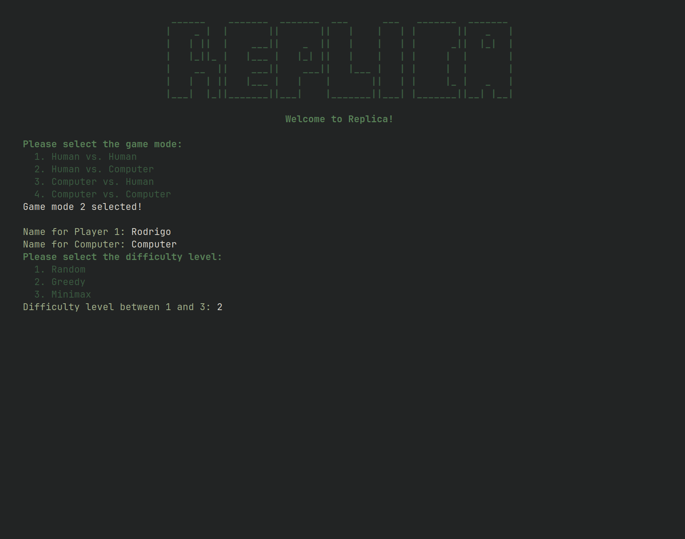
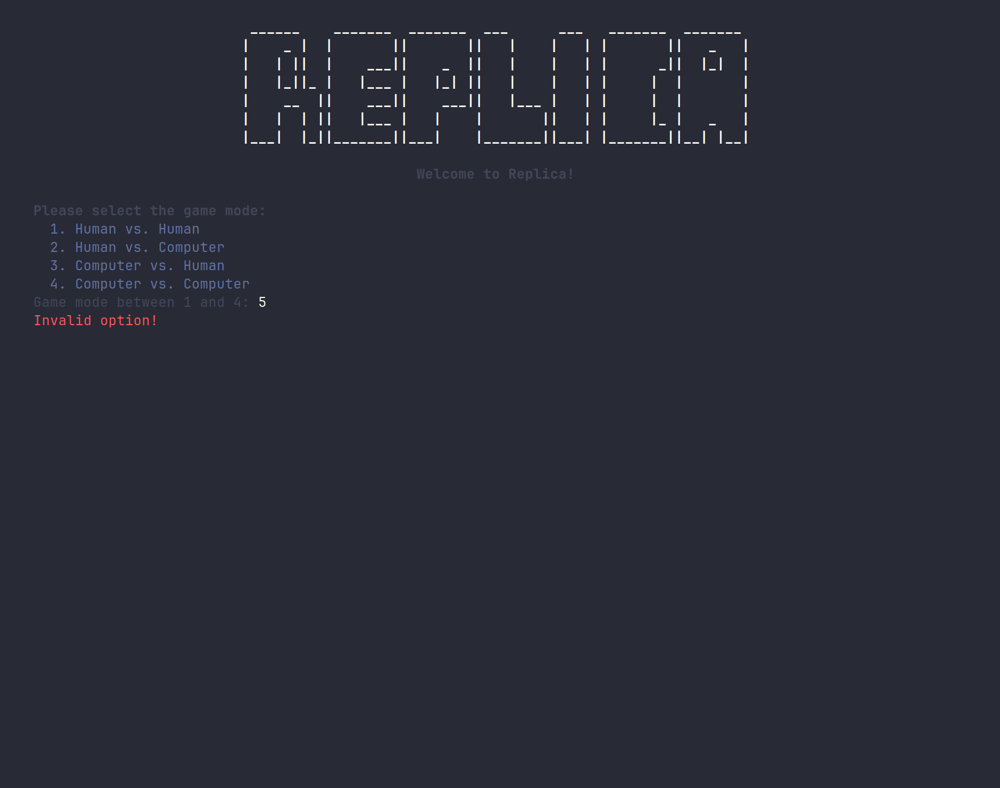
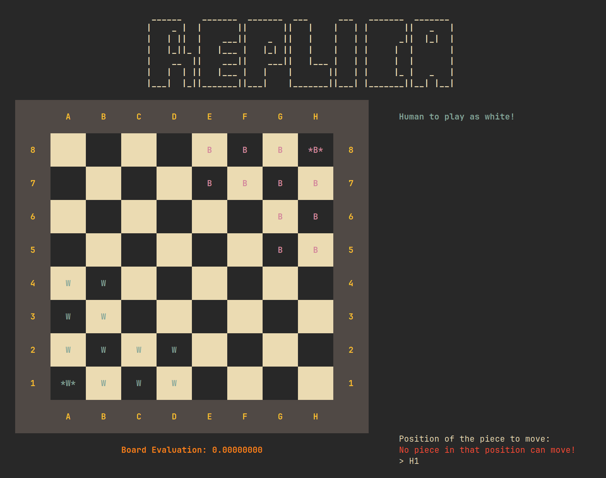
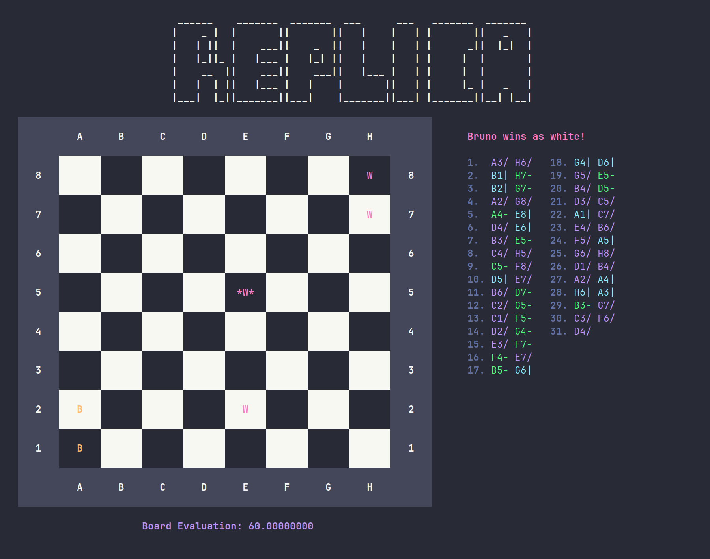
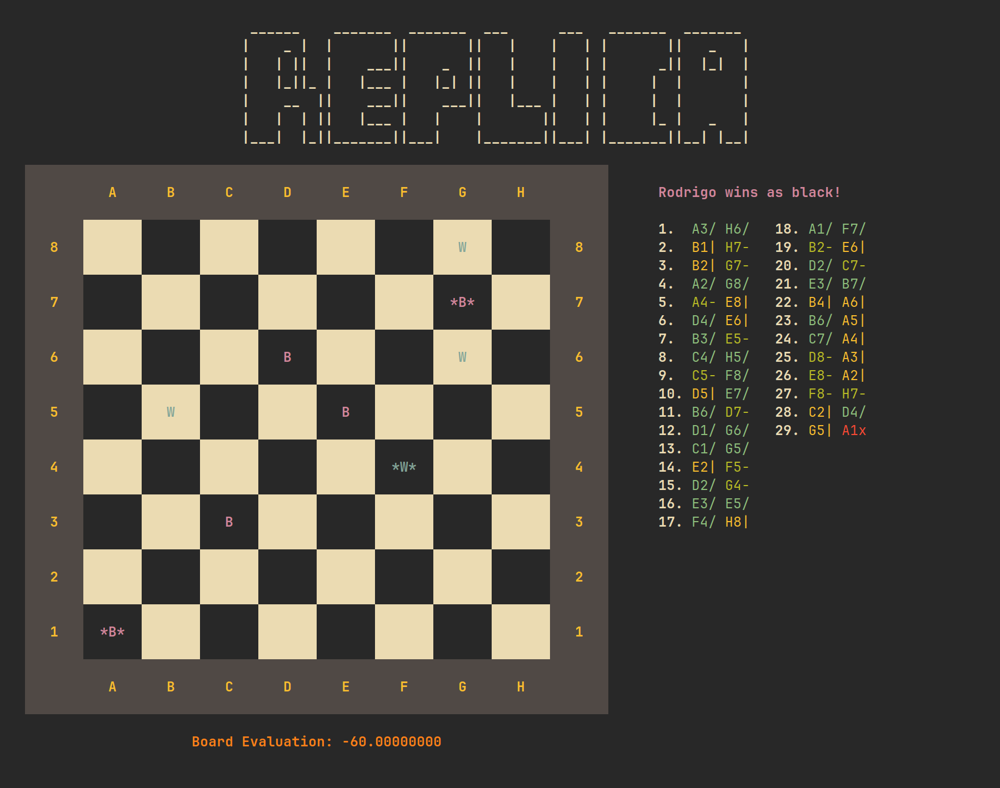

# Functional and Logical Programming (PFL) Project 2

## Game_Group: Replica_7

<figure align="center">

| Name                                           |      E-mail       | Contribution |
| :--------------------------------------------- | :---------------: | -----------: |
| Bruno Ricardo Soares Pereira de Sousa Oliveira | up202208700@up.pt |          50% |
| Rodrigo Albergaria Coelho e Silva              | up202205188@up.pt |          50% |

</figure>

### Tasks Developed

- **Bruno Ricardo Soares Pereira de Sousa Oliveira**
  - Implementation of the Board and Game Logic
  - Development of third level of AI (Minimax)
  - Documentation and Review of the code
- **Rodrigo Albergaria Coelho e Silva**
  - Implementation of the User Interaction and Interface
  - Development of third level of AI (Minimax)
  - Documentation and Review of the code

## Installation and Execution

The project was made to run using SICStus Prolog 4.9. The process is identical for both Linux and Windows operating systems:

1. **Make sure you are using a proper terminal**: the project uses ANSI escape sequences for a better interface. In order for them to work, please use a terminal that supports these sequences:
   - **Windows**: **PowerShell** or Windows Terminal.
   - **Linux**: Any **modern terminal emulator** should work.  
  > **Note**: we also assumed that the terminal size is of about 120x40 characters, some window or font resizing may be needed to correctly load the interface.
2. **Load the Project**: navigate to the project directory and load the main file by executing the following command:
   ```bash
   sicstus -l src/game.pl
   ```
3. **Start the Game**: once SICStus Prolog has loaded, start the game by calling:
   ```prolog
   play.
   ```

## Description of the Game

Replica is a two player game played using a chessboard and 12 black and 12 white flippable checkers. Players setup the game by placing the checkers on the board in opposite corners (with a 2x2 square in the corner, flanked by a 2x2 square on each side). The pieces in the very corner start the game flipped over (indicating a king). Players make one move per turn, starting with White.

On each turn, players either step, jump, or transform. All moves (even captures) must go "forward" (1 of the 3 directions towards the opponent corner). For steps and for jumps, if there is already a piece on the destination square, it is captured by replacement. For a step, the piece moves forward one square. For a jump, the piece moves in a straight line forward over friendly pieces until it reaches a square not occupied by a friendly piece. For a transform, a friendly non-king piece in line-of-sight of a friendly king gets flipped (this creates another friendly king). Only enemy pieces block line of sight.

The game is over if a player wins by getting any friendly king into the opposite corner, or wins by capturing any enemy king.

\- _description from designer (abridged)_

<figure align="center">
  <div style="display: flex; justify-content: center; align-items: center; gap: 10px;">
    
    
    
  </div>
  <figcaption>Fig. 1 Examples Different States of the Game</figcaption>
</figure>

<!--
\begin{figure}[ht]
    \centering
    \includegraphics[width=0.3\linewidth]{./imgs/menu.png}
    \includegraphics[width=0.3\linewidth]{./imgs/game.png}
    \includegraphics[width=0.3\linewidth]{./imgs/endgame.png}
    \caption{Examples of Different States of the Game}
\end{figure}
-->

## Considerations for Game Extensions

For this game, we agreed that part of what makes is special is the simplicity of the rules. Some examples of additional rules were provided in the original game description, but we didn't find any of them to be particularly fitting as they tended to involve completely game-changing mechanics. We also considered prompting user input for the board size, but it couldn't be much less than 8x8 (because of the board setup) and larger board sizes would only make the games less interesting as most of the moves would just be passive, so we decided against it.

Nonetheless, we kept the game implementation flexible to allow for variable board sizes and additional rules to be added in the future easily (although the interface might need some small adjustments). The interface is also extendable to allow the user to choose the theme and other parameters. Finally, we also implemented a third level of AI using Minimax to make the game more challenging (more details below).

## Game Logic

### Game Configuration Representation

Before the actual game starts, some configurations are needed to defined what type of game will be played. These configurations are stored stored in a `game_config` functor that is filled in the initial menus of the game. It is structured as follows:

```prolog
GameConfig = game_config(GameMode, Player1Info, Player2Info).
PlayerInfo = player_info(PlayerName, PlayerDifficulty).
```

where `GameMode` is an integer between 1 and 4 (1 for Human vs Human, 2 for Human vs Computer, 3 for Computer vs Human and 4 for Computer vs Computer), `PlayerName` is a string with the name of the player, and `PlayerDifficulty` is an integer between 0 and 3 (0 for Human, 1 for Easy (random moves), 2 for Medium (greedy moves), 3 for Hard (minimax moves)).

The `GameConfig` is saved onto the initial `GameState` and is used throughout the game to access the name of the players and how the next move should be obtained.

### Internal Game State Representation

At any step, the game state is stored in a `state` functor, which has the following schema:

```prolog
GameState = state(Board, CurrentPlayer, KingEaten, MoveCounter, GameConfig)
Board = board(Tiles, Size)
```

All the information stored is useful for at least one aspect of the game, whether it is related to the game logic and rules or the visualization.

The board is represented using the `board` functor, which contains the board tiles and size. The latter is used to allow flexible board sizes, even though it is not used since the board has a fixed 8x8 size, according to the game rules. For a board of size N, Tiles is a list matrix of N x N tiles, where each tile can be one of five atoms: `empty`, `white_piece`, `black_piece`, `white_king` and `black_king`.

### Move Representation

### User Interaction

The files associated with the user interaction are the `display.pl` and `input.pl`:

- The `display.pl` file contains all predicates that print something to the screen (game title, option menus, **input prompts**, game board and other indications such as evaluation or move history). This file makes extensive use of the `ansi.pl` module developed and uses the configurations specified in the `theme.pl`, more details about this can be found below.
- The `input.pl` file contains the predicates responsible for reading user input (numbers/options, strings/names and positions/coordinates), without producing any output, in the following ways:
  - **Numbers**: read as the resulting integer from concatenating all the digits in the input string (i.e. skipping all the other characters until it reaches the end of the line)
  - **Strings**: read as the concatenation of all the characters with ASCII codes between 32-127, which includes spaces, numbers, letters and other symbols and punctuation (also skips all other characters until it reaches the end of the line)
  - **Positions**: referenced as a spreadsheet where the position is a combination of letters and numbers. Letters refer to the column, numbers to the row, and their order doesn't matter. Characters that are larger than a given coordinate range (or are irrelevant) are skipped automatically. When the coordinate only needs one character, the first valid character is considered. Otherwise, all valid symbols for a given coordinate are read and concatenated for spreadsheet-like indexing (i.e. rows: ... 9, 10, 11 ... and columns: ... Z, AA, AB ...). This was done to make the predicates more flexible for larger board sizes.  
  > As an example, all of the following "inputs" represent the same position (Column A, Row 8) in an 8x8 board: `a8`, `az8`, `ai8`, `8a`, `89za`, `8 _ a`, `l8-askd-jsa_das123888812312`.

When it comes to input validation, some small validations are performed by the input predicates (mostly skipping unwanted characters), but on top that, the predicates from the `display.pl` that use them also make some verifications:

- **Options**: for option menus, it is checked that the number is contained between 1 and the total number of options
- **Positions**: for positions, it is checked that the position corresponds to a piece with valid moves for the current state of the board

Any errors that occur from the previous validations will simply display an error message to the user and prompt for new input from the user.

<figure align="center">
  <div style="display: flex; justify-content: center; align-items: center; gap: 10px;">
    
    
  </div>
  <figcaption>Fig. 2 Examples of input validations</figcaption>
</figure>

<!--
\begin{figure}[ht]
    \centering
    \includegraphics[width=0.45\linewidth]{./imgs/input-option.png}
    \includegraphics[width=0.45\linewidth]{./imgs/input-position.png}
    \caption{Examples of input validations}
\end{figure}
-->

### Game Interface

As mentioned before, our game uses ANSI escape sequences to provide a better interface and assumes a terminal size of 120x40 characters to fully display the entire game. For this, we developed a module `ansi.pl` that contains all the necessary predicates to use these sequences. These predicates are capable of changing the text color, background color, text style, cursor position, clearing the screen, and other useful actions.

Additionally, we also allow users to modify the themes of the interface by changing the `theme.pl` file. This file is the one that contains the configurations for the interface, such as the colors used for the different elements of the display and the symbols used for the pieces. The game comes with a default theme, but we also define some other themes that can be swapped directly with the `theme.pl` file.

<figure align="center">
  <div style="display: flex; justify-content: center; align-items: center; gap: 10px;">
    
    
  </div>
  <figcaption>Fig. 3 Examples of other themes (Dracula and Gruvbox)</figcaption>
</figure>

<!--
\begin{figure}[ht]
    \centering
    \includegraphics[width=0.45\linewidth]{./imgs/dracula.png}
    \includegraphics[width=0.45\linewidth]{./imgs/gruvbox.png}
    \caption{Examples of other themes (Dracula and Gruvbox)}
\end{figure}
-->

### Third Level of AI (Minimax)

## Conclusions

## References
